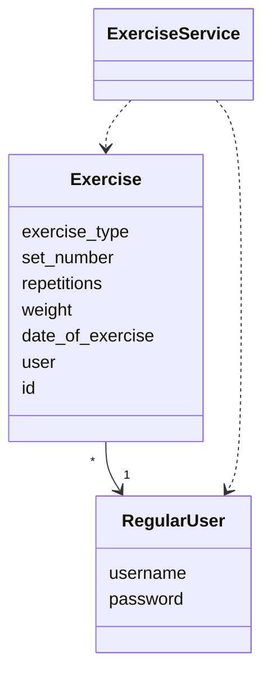

# Architecture

## Package diagram

[Package diagram](https://github.com/sippohippo/ot-harjoitustyo/blob/master/dokumentaatio/packagediagram.png)

## Application logic

The main two classes of the app are RegularUser that represent the users who record exercises and Exercise, which represents the completec exercises during a visit to the gym

