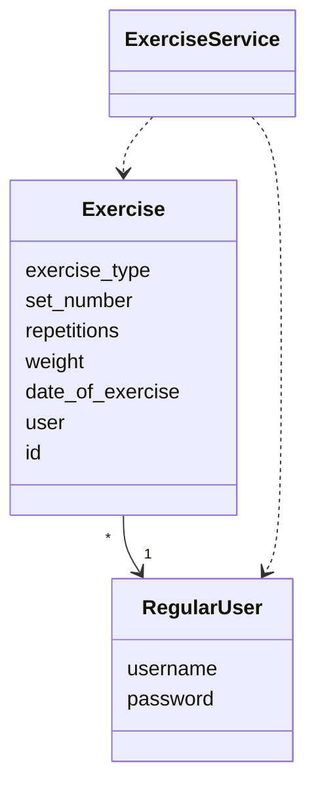
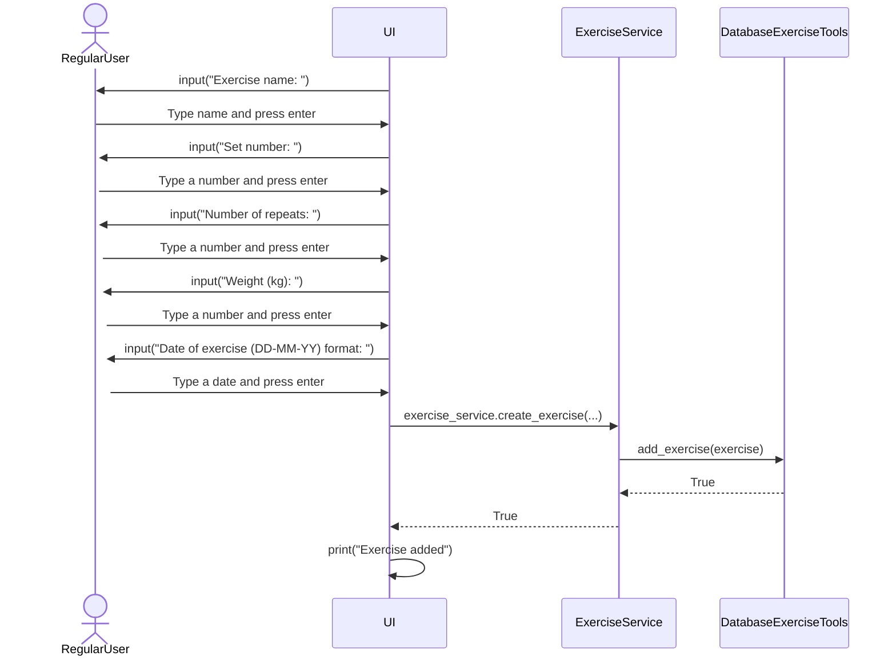
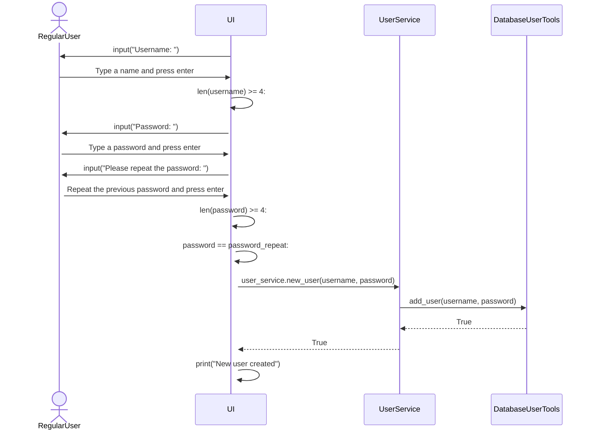
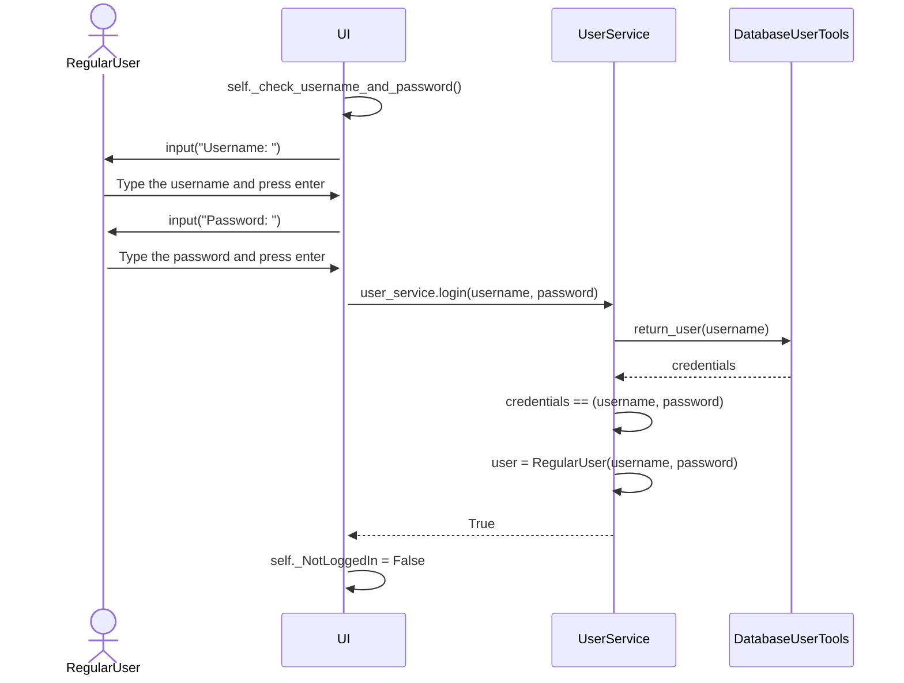

# Architecture

## Package diagram

The structure of the program follows the architecture laid out in the package diagram below.

The UI package is self explanatory as it contains the script that houses the user interface. The services package contains the main application logic, which is divided into two separate areas. Lastly, the entities package houses the main classes that are created, manipulated and stored: users and exercises. Left outside of the packages is the main script that executes the program, as well as three helper scripts that contains the initialization of the database and tools for accessing the databases user and exercises tables.

## User interface (UI)

The user interface is a classical text UI that is used through a command line. It consists on multiple different views, or menus, for the different actions. The larger menus are:

* Login menu
* Main menu
* Exercise viewing menu
* Exercise adding menu  

In addition, there are smaller submenus where some inputs are given:

* New user creation 
* View exercise by date 
* Edit exercise 
* Delete exercise 
* Remove user

## Application logic

The main two classes of the app are `RegularUser` that represent the users who record exercises and `Exercise`, which represents the completed exercises during a visit to the gym.

The application logic is housed in the services package and more specifically the `ExerciseService` and `UserService` classes. These classes are controlled by inputs given through the UI and provide methods for interacting with the database indirectly through the `DatabaseUserTools` and `DatabaseExerciseTools` classes.

## Sequence diagrams of different functionalities

The sequence diagrams below explain how some critical components of the application logic functions under the hood. 

### Adding an exercise

When a user decides to add a new exercise after logging in and selecting to go to add exercise mode, the following happens:

### Adding a new user

When the user has chosen to create a new user from the starting menu the following happens in the application logic:

### Logging in

When the user has selected to log in to an existing account in the starting menu the following happens in the application logic:

## Data storage

### High-level description

The data, which in this case is information on the users and exercises done by the users are stored in a SQLite database. These are stored in respectively named tables. The relational schema below shows the column names as well as relationship between the two tables.

As can be seen, the username is a foreign key in the exercises table. Each user can have many exercises, but each exercise can have only one user. 

### DatabaseExerciseTools and DatabaseUserTools classes

The `DatabaseExerciseTools` and `DatabaseUserTools` classes are used by the `ExerciseService` class and `UserService` class to directly interact and manipulate the database. This way the program logic is separated from the database more explicitly. Note that both of these database tools classes are stored outside of the packages in the main src directory in the file [database_user_tools.py](https://github.com/sippohippo/ot-harjoitustyo/blob/master/src/database_user_tools.py) and [database_exercise_tools.py](https://github.com/sippohippo/ot-harjoitustyo/blob/master/src/database_exercise_tools.py). 

# Known flaws in the current architecture

As this is primarily designed for personal use, it does not take into consideration the fact that in the database there will be a problem if two separate users were to record the exact same exercise, as these would not be unique. This could be fixed by adding an additional ID column.

