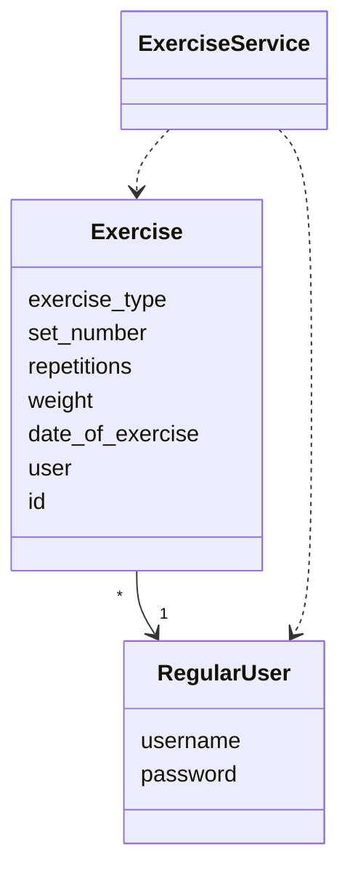
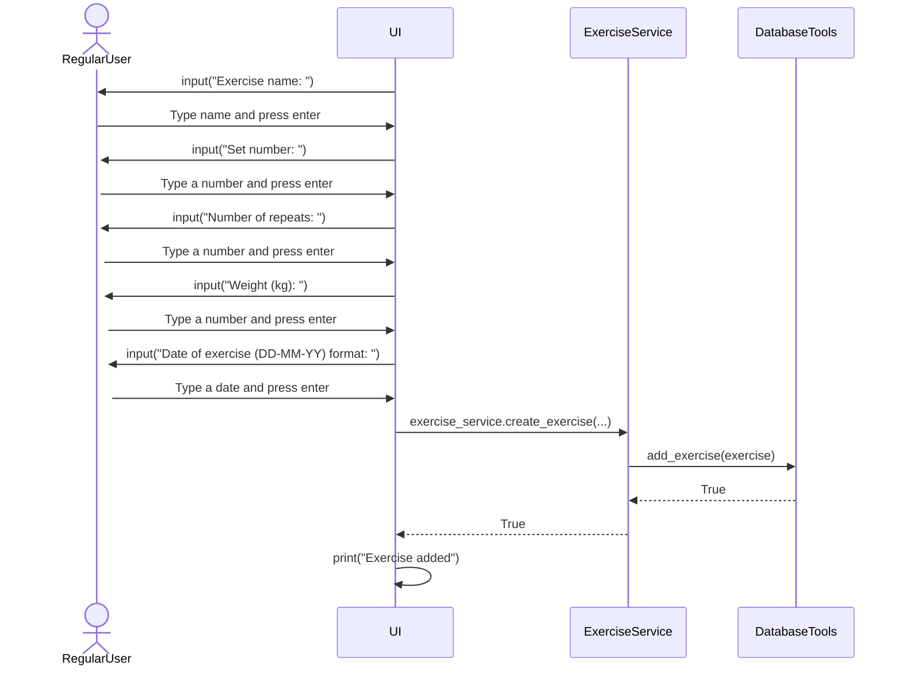

# Architecture

## Package diagram

## Application logic

The main two classes of the app are RegularUser that represent the users who record exercises and Exercise, which represents the completed exercises during a visit to the gym.

## Sequence diagrams

The sequence diagrams below explain how some critical components of the application logic functions under the hood. 

### Adding an exercise

When a user decides to add a new exercise after logging in and selecting to go to add exercise mode, the following happens:

