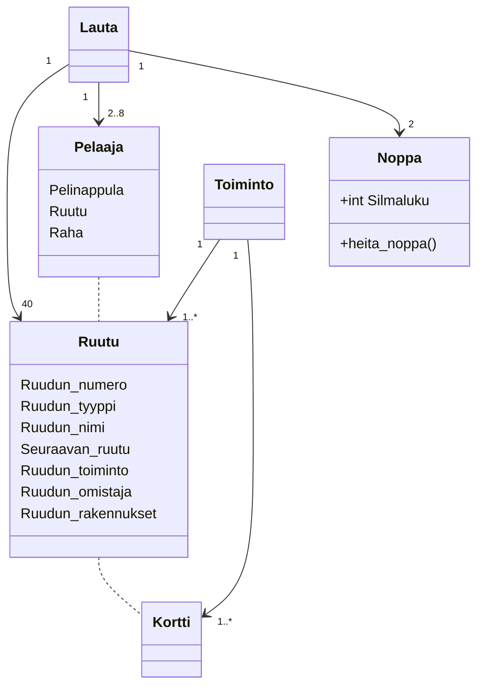

```mermaid


classDiagram
    Lauta "1" --> "40" Ruutu
    Lauta "1" --> "2..8" Pelaaja
    Lauta "1" --> "2" Noppa
    Toiminto "1" --> "1..*" Ruutu
    Toiminto "1" --> "1..*" Kortti
    Ruutu .. Kortti
    Pelaaja .. Ruutu 

    class Pelaaja{
      Pelinappula
      Ruutu
      Raha
    }

    class Ruutu{
     Ruudun_numero
     Ruudun_tyyppi
     Ruudun_nimi
     Seuraavan_ruutu
     Ruudun_toiminto
     Ruudun_omistaja
     Ruudun_rakennukset
    }

    class Noppa{
      +int Silmaluku
      +heita_noppa()
    }

    class Toiminto{
    }

    class Kortti{
    }

```
